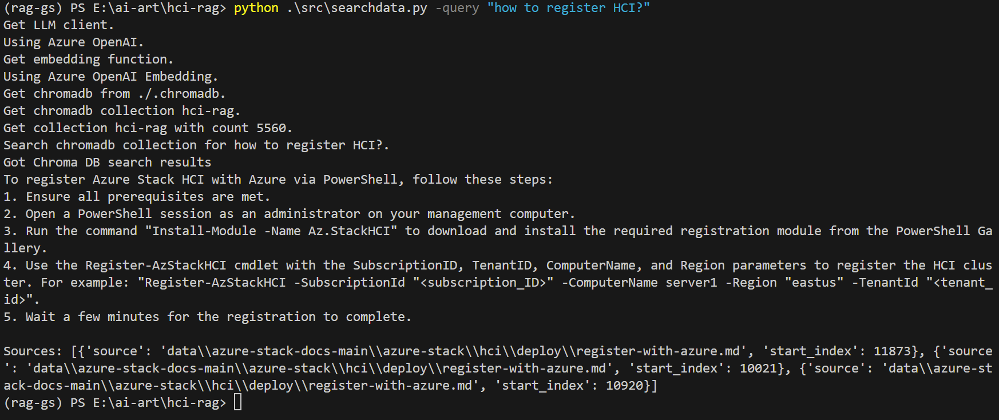

# Overview
[Retrieval Augmented Generation](https://ai.meta.com/blog/retrieval-augmented-generation-streamlining-the-creation-of-intelligent-natural-language-processing-models/) article  published in September 2020, says:
> RAG frees researchers and engineers to quickly develop and deploy solutions to their own knowledge-intensive tasks with just [five lines of code](https://huggingface.co/facebook/rag-token-nq#usage).
    ```python
    from transformers import RagTokenizer, RagRetriever, RagTokenForGeneration

    tokenizer = RagTokenizer.from_pretrained("facebook/rag-token-nq")
    retriever = RagRetriever.from_pretrained("facebook/rag-token-nq", index_name="exact", use_dummy_dataset=True)
    model = RagTokenForGeneration.from_pretrained("facebook/rag-token-nq", retriever=retriever)

    input_dict = tokenizer.prepare_seq2seq_batch("who holds the record in 100m freestyle", return_tensors="pt") 

    generated = model.generate(input_ids=input_dict["input_ids"]) 
    print(tokenizer.batch_decode(generated, skip_special_tokens=True)[0])
    ```


Wow, I've managed to grasp the concept after some  analysis! Let me simplify it for you:

First, let me explain some of the basic concepts:
## Vector
**Vector** is a list of numbers representing different data. For example, imagine if you've to represent fruits using vector!
  - Apple: [1, 0, 0]
  - Banana: [0, 1, 0]
  - Cherry: [0, 0, 1]

## Embeddings
**Embeddings** are a special kind of vector. They are designed to capture more complex data in a way that shows relationships and meanings. For example, words can be converted into embeddings that show their meanings and how they relate to other words. 

Imagine you have a way to represent these fruits that shows their similarities:
- Apple: [0.9, 0.1, 0.0] (similar to another sweet fruit, cherry)
- Banana: [0.1, 0.8, 0.1] (unique in its own way)
- Cherry: [0.8, 0.2, 0.0] (similar to apple)

## Semantic meaning
When we talk about **"semantic meaning"**, we're talking about the deeper meaning and context behind words or data. 

Another example is the word "king" might be close to the word "queen" in this special vector space, showing that they are related in meaning. In regular language, we know that "king" and "queen" are related because they both refer to royalty. Embeddings capture this relationship by placing these words close together in a numerical space.

## Step-by-Step RAG System

1. **Loading files**: Imagine you've gathered all your documents and put them into a folder. You've got these documents loaded into your system.

2. **Chunking documents**: Instead of dealing with whole documents, you break them into smaller pieces, or "chunks." This makes the data easier to manage. For instance, you might break a long article into paragraphs or sentences.

3. **Creating Embeddings**: Next, you convert these chunks into embeddings. You use a model (like BERT) to turn each chunk into a vector that captures its meaning. Think of it as translating text into a list of numbers that represent the semantic meaning.

4. **Creating an Index**: With all your chunks now represented as embeddings (vectors), you create an index. This index is like a super-efficient library catalog. It helps you quickly find the chunks that are most relevant to any query.

5. **Retreive relevant chunks**: Let's say now you ask, "What is the capital of India?" The system converts your question into an embedding, searches the index for the most relevant chunks, which might include a chunk that says "New Delhi is the capital of India".

6. **Generating responses**: Finally, you take these relevant chunks and use them as context to generate a response. You use a language model (like GPT-3) and relevant answer based on the chunks you retrieved to create a coherent answer, "The capital of India is New Delhi."

This whole process makes sure that the generated answer is informed by the most relevant pieces of information from your documents, making the answers accurate and contextually rich.

## Files

### Create Index
[src/createChromaDBlc.py](src/createChromaDBlc.py): Creates a Chroma DB from local folder of Markdown files. This uses LangChain.


### Retrieve answer

#### Via Console

- [src/searchdatalc.py](src/searchdatalc.py): Search local Chroma DB based results and provide results using LLM. This use LangChain.
- [src/searchdata.py](src/searchdata.py): Search local Chroma DB based results and provide results using LLM. This doesn't use LangChain.

#### Via Web UI
[src/app.py](src/app.py): Uses [Streamlit](https://streamlit.io/) based web app to search local Chroma DB and provide results using LLM. This uses LangChain.


# Set up the project

## Set up conda env
1. Create virtual environment in Python using Conda. To install Miniconda, follow the instructions [here](https://docs.anaconda.com/miniconda/miniconda-install/).

1. Create a new environment
    ```shell
    conda create -n rag-gs
    ```
1. Activate a Virtual Environment on Windows
    ```shell
    conda activate rag-gs
    ```
## Install dependencies
```shell
pip install numpy
pip install openai
pip install python-dotenv
pip install streamlit
pip install langchain
pip install langchain-openai
pip install langchain-community
pip install langchain-text-splitters
pip install unstructured
pip install "unstructured[md]"
pip install nltk
pip install chromadb
```
or use `requirements.txt` to install
```shell
pip install -r requirements.txt
```

## Download the Azure Stack HCI docs
To download the Azure Stack HCI docs, you can follow these steps:

1. Open your web browser and go to the [Azure Stack HCI docs repository](https://github.com/MicrosoftDocs/azure-stack-docs/).

1. Click on the green "Code" button located on the right side of the repository.

1. In the dropdown menu, select "Download ZIP". Save the ZIP file to a location on your computer.
    ```shell
    mkdir data
    wget https://github.com/MicrosoftDocs/azure-stack-docs/archive/refs/heads/main.zip -O data/docs.zip
    ```

1. Once the download is complete, extract the contents of the ZIP file to a desired folder.
    ```shell
    cd data && unzip docs.zip
    ```

Now you have successfully downloaded the Azure Stack HCI docs. You can proceed with the next steps in your project.

## Set up your environment variable
1. Create a `.env` file
1. Add the following environment variables to the .env file
    ```env
    # Azure OpenAI API Key
    AZURE_OPENAI_API_KEY=your_azure_openai_api_key_here

    # Azure OpenAI Endpoint
    AZURE_OPENAI_ENDPOINT=your_azure_openai_endpoint_here

    # Azure OpenAI Deployment for Embedding
    AZURE_OPENAI_API_DEPLOYMENT_EMBEDDING=your_azure_openai_deployment_embedding_here
    AZURE_OPENAI_API_DEPLOYMENT=your_openai_deployment_chat_completion

    # OpenAI API Key, if you're using OpenAI
    OPENAI_API_KEY=your_openai_api_key_here

    # Azure OpenAI API version
    OPENAI_API_VERSION="2024-02-15-preview"
    ```
1. Save the `.env` file


## Create ChromaDB using Azure Stack HCI docs
1. Run the generate Chroma DB command
    ```shell
    python src/createChromaDBlc.py
    ```

## Check if the RAG is working
1. Run search data to see if RAG results are working properly.
    ```shell
    python src/searchdata.py -query "How to register HCI?"
    ```

    If you want to validate using LangChain, use below:
    ```shell
    python src/searchdatalc.py -query "How to register HCI?"
    ```

## Run streamlit
```shell
streamlit run ./src/app.py
```

# Disclaimer

> **Note:** Please note that there are currently a few outstanding issues with the quality of the local RAG (Retrieval-Augmented Generation) search results. I will be improving the accuracy and relevance of these results. Your understanding and patience are appreciated. This is a personal repository and provided "AS-IS" with no warranties or guarantees. 
