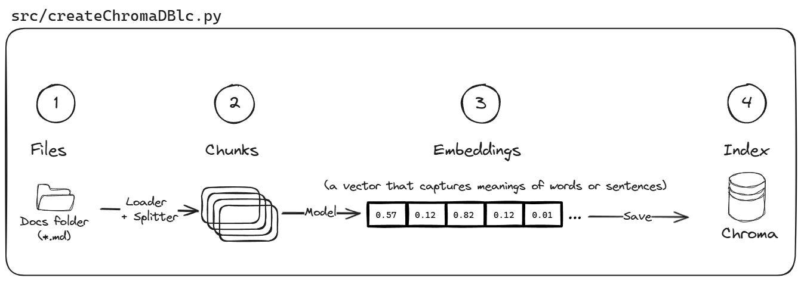

# Overview
[Retrieval Augmented Generation](https://ai.meta.com/blog/retrieval-augmented-generation-streamlining-the-creation-of-intelligent-natural-language-processing-models/) article  published in September 2020, says:
> RAG frees researchers and engineers to quickly develop and deploy solutions to their own knowledge-intensive tasks with just [five lines of code](https://huggingface.co/facebook/rag-token-nq#usage).

```python
from transformers import RagTokenizer, RagRetriever, RagTokenForGeneration

tokenizer = RagTokenizer.from_pretrained("facebook/rag-token-nq")
retriever = RagRetriever.from_pretrained("facebook/rag-token-nq", index_name="exact", use_dummy_dataset=True)
model = RagTokenForGeneration.from_pretrained("facebook/rag-token-nq", retriever=retriever)

input_dict = tokenizer.prepare_seq2seq_batch("who holds the record in 100m freestyle", return_tensors="pt") 

generated = model.generate(input_ids=input_dict["input_ids"]) 
print(tokenizer.batch_decode(generated, skip_special_tokens=True)[0])
```


Wow, I've managed to grasp the concept after some  analysis! Let me simplify it for you:

First, let me explain some of the basic concepts:
## Vector
**Vector** is a list of numbers representing different data. For example, imagine if you've to represent fruits using vector!
  - Apple: [1, 0, 0]
  - Banana: [0, 1, 0]
  - Cherry: [0, 0, 1]

## Embeddings
**Embeddings** are a special kind of vector. They are designed to capture more complex data in a way that shows relationships and meanings. For example, words can be converted into embeddings that show their meanings and how they relate to other words. 

Imagine you have a way to represent these fruits that shows their similarities:
- Apple: [0.9, 0.1, 0.0] (similar to another sweet fruit, cherry)
- Banana: [0.1, 0.8, 0.1] (unique in its own way)
- Cherry: [0.8, 0.2, 0.0] (similar to apple)

## Semantic meaning
When we talk about **"semantic meaning"**, we're talking about the deeper meaning and context behind words or data. 

Another example is the word "king" might be close to the word "queen" in this special vector space, showing that they are related in meaning. In regular language, we know that "king" and "queen" are related because they both refer to royalty. Embeddings capture this relationship by placing these words close together in a numerical space.

## Step-by-Step RAG System

1. **Loading files**: Imagine you've gathered all your documents and put them into a folder. You've got these documents loaded into your system.

2. **Chunking documents**: Instead of dealing with whole documents, you break them into smaller pieces, or "chunks." This makes the data easier to manage. For instance, you might break a long article into paragraphs or sentences.

3. **Creating Embeddings**: Next, you convert these chunks into embeddings. You use a model (like BERT) to turn each chunk into a vector that captures its meaning. Think of it as translating text into a list of numbers that represent the semantic meaning.

4. **Creating an Index**: With all your chunks now represented as embeddings (vectors), you create an index. This index is like a super-efficient library catalog. It helps you quickly find the chunks that are most relevant to any query.

5. **Retreive relevant chunks**: Let's say now you ask, "What is the capital of India?" The system converts your question into an embedding, searches the index for the most relevant chunks, which might include a chunk that says "New Delhi is the capital of India".

6. **Generating responses**: Finally, you take these relevant chunks and use them as context to generate a response. You use a language model (like GPT-3) and relevant answer based on the chunks you retrieved to create a coherent answer, "The capital of India is New Delhi."

This whole process makes sure that the generated answer is informed by the most relevant pieces of information from your documents, making the answers accurate and contextually rich.

## Just need to execute two files to try this!

### Create Index
Run [src/createChromaDBlc.py](src/createChromaDBlc.py) to create a Chroma DB from local folder of Markdown files. This uses LangChain.

>

### Retrieve answer
Run [src/searchdatalc.py](src/searchdatalc.py) to search local Chroma DB based results and provide results using LLM. This uses LangChain. In case you want to see how this works without LangChain, try [src/searchdata.py](src/searchdata.py)file.

>

```python
python src/searchdatalc.py -query "how to register HCI?"
```

To try out [Streamlit](https://streamlit.io/) based chat bot web app to find answers using local Chroma DB, LangChain and Open AI, check out [src/app.py](src/app.py).
>

### How Chroma works?
Chroma is the AI-native open-source vector database. Chroma makes it easy to build LLM apps by making knowledge, facts, and skills pluggable for LLMs. For more information, refer [documentation](https://docs.trychroma.com/).
>

# GitHub Codespaces

You can run this repo virtually by using GitHub Codespaces, which will open a web-based VS Code in your browser:

[](https://codespaces.new/anoobbacker/hci-rag)

Once the codespace opens (this may take several minutes), open a terminal window.

# Local environment
Install the required tools:

- [Python 3.9, 3.10, or 3.11](https://www.python.org/downloads/)
    - **Important**: Python and the pip package manager must be in the path in Windows.   
- [Powershell 7+ (pwsh)](https://github.com/powershell/powershell) - For Windows users only.
- [Miniconda](https://docs.anaconda.com/miniconda/miniconda-install/).
- [Git](https://git-scm.com/downloads)

# Set up the project in 10 steps

1. Create a new virtual environment and active using Conda. This step applies only to local environment.
    ```shell
    conda create -n rag-gs
    conda activate rag-gs
    ```

1. Install dependencies using `requirements.txt` to install
    ```shell
    pip install -r requirements.txt
    ```

1. In this case I'm using [Azure Stack HCI docs repository](https://github.com/MicrosoftDocs/azure-stack-docs/). To download the Azure Stack HCI docs, you can follow these steps:
    ```shell
    mkdir data
    wget https://github.com/MicrosoftDocs/azure-stack-docs/archive/refs/heads/main.zip -O data/docs.zip
    ```

1. Once the download is complete, extract the contents of the ZIP file to a desired folder.
    In Linux, run the below:
    ```shell
    cd data && unzip docs.zip
    ```

    or in Windows, run the below:
    ```PowerShell
    Expand-Archive -Path .\data\docs.zip -DestinationPath .\data
    ```

1. Set up your environment variable by create a `.env` file. Add the following environment variables to the .env file and save the `.env` file
    ```env
    # Azure OpenAI API Key
    AZURE_OPENAI_API_KEY=your_azure_openai_api_key_here

    # Azure OpenAI Endpoint
    AZURE_OPENAI_ENDPOINT=your_azure_openai_endpoint_here

    # Azure OpenAI Deployment for Embedding
    AZURE_OPENAI_API_DEPLOYMENT_EMBEDDING=your_azure_openai_deployment_embedding_here
    AZURE_OPENAI_API_DEPLOYMENT=your_openai_deployment_chat_completion

    # OpenAI API Key, if you're using OpenAI
    OPENAI_API_KEY=your_openai_api_key_here

    # Azure OpenAI API version
    OPENAI_API_VERSION="2024-02-15-preview"
    ```
1. Run the generate Chroma DB command to create ChromaDB using Azure Stack HCI docs
    ```shell
    python src/createChromaDBlc.py
    ```

1. To check if the RAG is working, run search data to see if RAG results are working properly.
    ```shell
    python src/searchdata.py -query "How to register HCI?"
    ```

    If you want to validate using LangChain, use below:
    ```shell
    python src/searchdatalc.py -query "How to register HCI?"
    ```

1. Run streamlit to try out the chat bot experience
    ```shell
    streamlit run ./src/app.py
    ```

# Disclaimer

> **Note:** Please note that there are currently a few outstanding issues with the quality of the local RAG (Retrieval-Augmented Generation) search results. I will be improving the accuracy and relevance of these results. Your understanding and patience are appreciated. This is a personal repository and provided "AS-IS" with no warranties or guarantees. 
